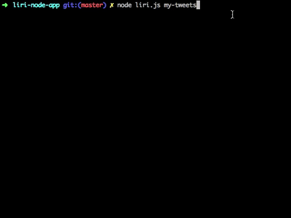
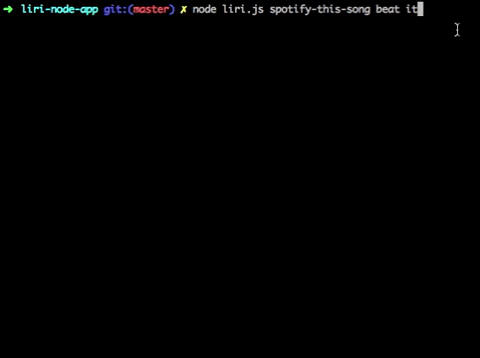
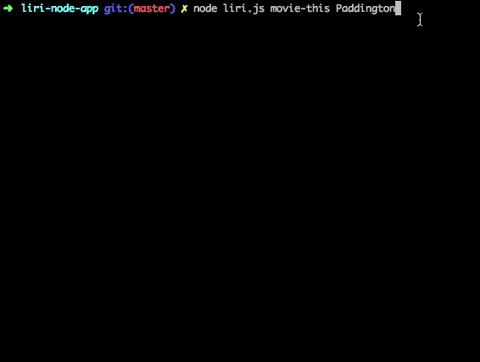

# LIRI Bot
LIRI Bot is a personal assistant application designed for UNC Coding Bootcamp Week 10. This application takes four commands as arguments in the terminal/bash:

## Commands

1. my-tweets: Runs the latest 20 tweets for whatever Twitter username is specified.


2. spotify-this-song: Receives a song search input (as subsequent arguments) and returns song, artist, and album information. <br/>


3. movie-this: Receives a movie title input (as subsequent arguments) and returns information about the film.


4. do-what-it-says: Whatever is specified in the random.txt file will execute.

## Packages/APIs Used
This application utilizes Node.js and the following npm packages and APIs:
1. [Twitter](https://www.npmjs.com/package/twitter "Twitter")
2. [Spotify](https://www.npmjs.com/package/node-spotify-api "Spotify")
3. [Request](https://www.npmjs.com/package/request "Request") 
4. [DotEnv](https://www.npmjs.com/package/dotenv "DotEnv")
5. [OMDB API](http://www.omdbapi.com/ "OMDB API")

### Downloading This Application
To use this application:

1. Ensure that Node.js and npm are installed on your machine. For instructions, see the Technologies Used section below.
- Next, clone this repo to your local machine:
```
git clone git@github.com:stoversa/liri-node-app.git
```
2. Open the repo and execute the following in the bash terminal. Doing so should install the required NPM packages:
```
npm i